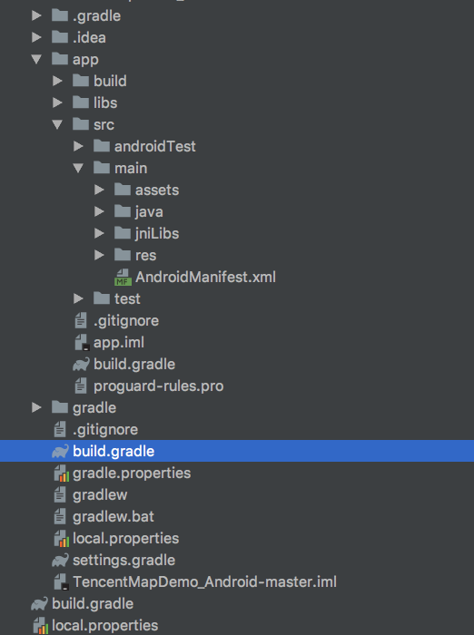
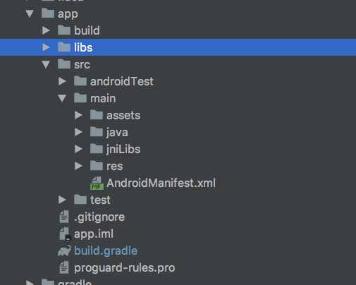
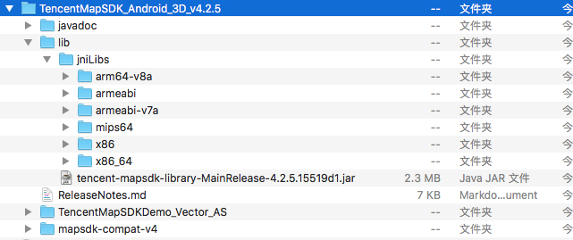
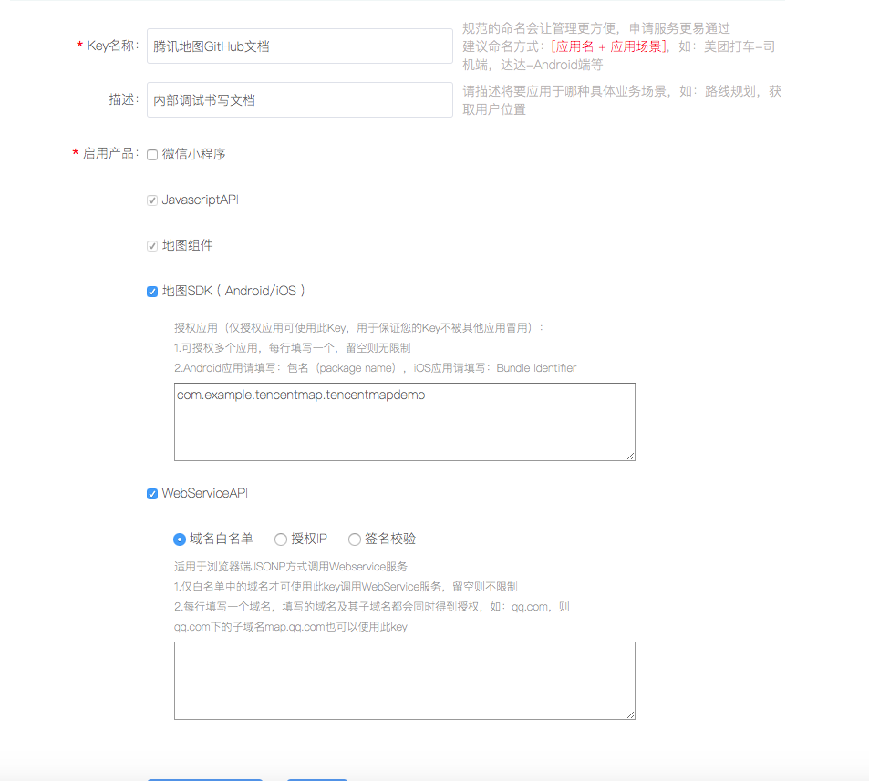
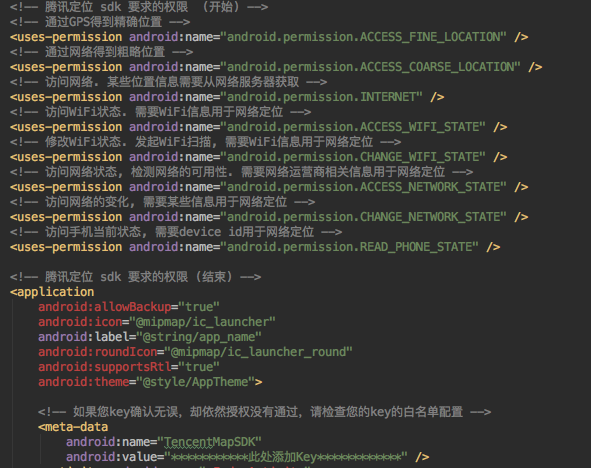

<style>
    @import url(style/style.css);
</style>

#工程配置

这里我们提供了腾讯地图 SDK 在 Android Studio 中的工程配置方法。

## Android Studio配置
在 Android Studio 项目中集成腾讯地图 SDK 主要有两种方法

1. 通过 Gradle 配置 maven 或 jcenter 仓库集成 SDK
2. 手动将腾讯地图 sdk 的 jar 包和 so 库导入到工程

我们更推荐用户使用第一种方法，即，通过 maven 导入腾讯地图 SDK，下面我们详细介绍下两种方法。

### 一、通过 Gradle 配置 maven 或 jcenter 仓库集成 SDK
#### 1、在 Project 的 build.gradle 文件中配置 repositories，添加 maven 或 jcenter 仓库地址
Android Studio 默认会在 Project 的 build.gradle 为所有module自动添加 jcenter 仓库地址，如果已存在，则不需要重复添加。Project 的 build.gradle 文件在 Project 目录中位置如图所示：

向所有模块配置仓库：
```properties
allprojects {
    repositories {
        google()
        jcenter() 
    }
 }
```
#### 2、在主工程 app module 的 build.gradle 文件配置 dependencies
app module 的 build.gradle 文件在 Project 目录中位置：

如需引入指定版本 SDK（所有 SDK 版本号与官网发版一致），则在 app module 的 build.gradle 中修改 maven 仓库版本号即可，如下图所示（4.2.4版本）：

```xml
dependencies {
    implementation fileTree(include: ['*.jar'], dir: 'libs')
    implementation 'com.tencent.map:tencent-map-vector-sdk:4.2.4'
}
```
以腾讯地图的demo工程为例，添加地图SDK的配置如下：


### 二、通过拷贝 jar 包、so 库添加 SDK
首先，请您在[这里](https://lbs.qq.com/android_v1/log.html)获取腾讯地图 SDK for Andorid 及其 demo。
#### 1、解压下载的压缩包并拷贝文件
以腾讯地图的demo工程为例，项目的目录结构如下图所示：

压缩包解压后的文件目录结构如下图所示：

将 lib 目录下的"*.jar"文件拷贝到 Android Studio 项目对应的 app/libs/ 文件夹下。  
将 jniLibs 目录下的所有文件按照原目录格式，拷贝到Android Studio项目对应的 app/src/main/jniLibs/ 目录下。  

#### 2、修改配置
在 app module 的 build.gradle 里修改 dependencies，在项目中的位置如下图所示：


添加如下代码，rebuild 一下即可。
```properties
implementation fileTree(dir: 'libs', include: ['*.jar'])
```
最终 app module 的 build.gradle 修改示例如下：


#### 注意事项：
依照上述方法集成SDK以后，就不需要使用第一种方式集成地图 SDK，否则会出现类冲突。

## 权限配置
地图SDK需要使用网络，访问硬件存储等系统权限，在AndroidManifest.xml文件里，添加如下权限：

```xml
<!--腾讯地图 SDK 要求的权限(开始)-->
<!--访问网络获取地图服务-->
<uses-permission android:name="android.permission.INTERNET"/>
<!--检查网络可用性-->
<uses-permission android:name="android.permission.ACCESS_NETWORK_STATE"/>
<!-- 访问WiFi状态 -->
<uses-permission android:name="android.permission.ACCESS_WIFI_STATE" />
<!--需要外部存储写权限用于保存地图缓存-->
<uses-permission android:name="android.permission.WRITE_EXTERNAL_STORAGE"/>
<!--获取 device id 辨别设备-->
<uses-permission android:name="android.permission.READ_PHONE_STATE"/>
<!--腾讯地图 SDK 要求的权限(结束)-->
```

## key配置 ##

要正常使用腾讯地图SDK用户需要在[https://lbs.qq.com/console/key.html](https://lbs.qq.com/console/key.html)申请开发密钥：

申请开发密钥是免费的，腾讯地图SDK的使用也是免费的。
Key的设置如下图所示：

其中地图SDK的对应位置，应传入对应App的包名，保存设置即可。
开发者申请key后，把Key输入工程的AndroidManifest.xml文件中，在application节点里，添加名称为TencentMapSDK的meta，如下所示(value值为申请的key)：

```xml
<application
	<meta-data
        android:name="TencentMapSDK"
        android:value="*****-*****-*****-*****-*****-*****"/>
</application>
```
以腾讯地图的 demo 工程为例，AndroidManifest.xml 的权限配置与 key 配置的示例如下图所示：  


## 混淆配置 ##

如果需要混淆您的工程，请在module里找到proguard-rules.pro文件，添加如下混淆脚本：

```properties
-keep class com.tencent.tencentmap.**{*;}
-keep class com.tencent.map.**{*;}
-keep class com.tencent.beacontmap.**{*;}
-keep class navsns.**{*;}
-dontwarn com.qq.**
-dontwarn com.tencent.**
```