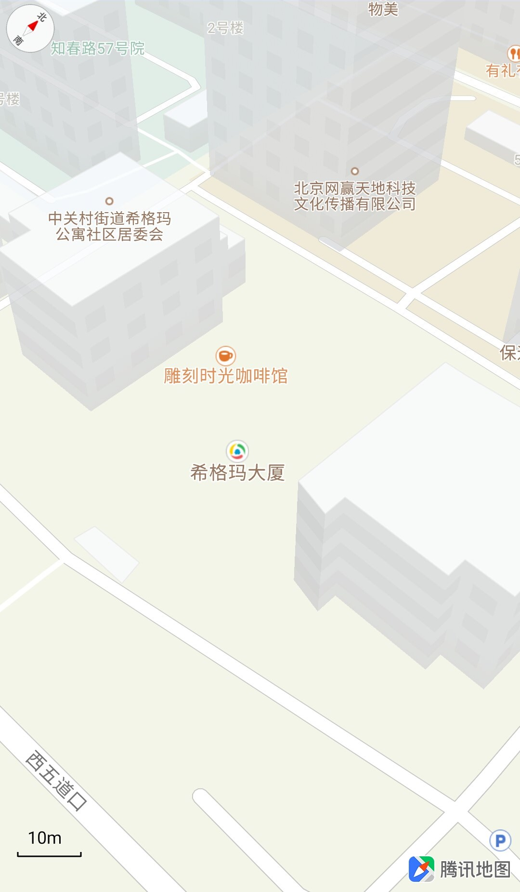

# 设置地图视野

### 简介

MapView 可以认为是在展示区域的地图上空的一台相机，相机的状态可以通过以下参数描述:

* 级别(zoom) : 要展示的地图级别
* 中心点(target) : 要展示的地图中心点经纬度坐标
* 倒伏角度(skew) : 以相机为顶点与地图平面的垂线和地图中心点之间的夹角
* 旋转角度(rotate): 相机与地图中心点之间的夹角在地图平面上的投影与北极的夹角

### 相机构造工厂

`CameraUpdateFactory` 提供了一些工厂方法帮助用户快速构造需要的地图视野参数

| 方法名 | 说明 |
| :- | :- |
| newLatLng(LatLng latlng) | 地图中心点为 latlng |
| newLatLngZoom(LatLng latlng, float zoom) | 以 latlng 为地图中心点，以 zoom 为地图级别 |
| zoomIn() | 放大一级 |
| zoomOut() | 缩小一级 |
| zoomTo(float zoomLevel) | 缩小一级 |
| zoomBy(float zoomLevelDelta) | 缩放级别修改 zoomLevelDelta |
| zoomBy(float zoomLevelDelta, Point point) | 以 point 屏幕坐标为缩放中心修改缩放级别 zoomLevelDelta |
| rotateTo(float rotate, float skew) | 设置地图的倒伏角度为 skew，旋转角度为 rotate |
| newCameraPosition(CameraPosition cameraposition) | 用户自己构造需要的相机参数 |

### 设置视野

在构造出相机更新对象后，通过 TencentMap.moveCamera(CameraUpdate cameraUpdate) 将地图视野设置为用户期望的状态。

``` java
CameraUpdate cameraSigma =
    CameraUpdateFactory.newCameraPosition(new CameraPosition(
        new LatLng(39.977290,116.337000), //中心点坐标，地图目标经纬度
        19,  //目标缩放级别
        45f, //目标倾斜角[0.0 ~ 45.0] (垂直地图时为0)
        45f)); //目标旋转角 0~360° (正北方为0)
tencentMap.moveCamera(cameraSigma); //移动地图
```

效果如下图所示：

