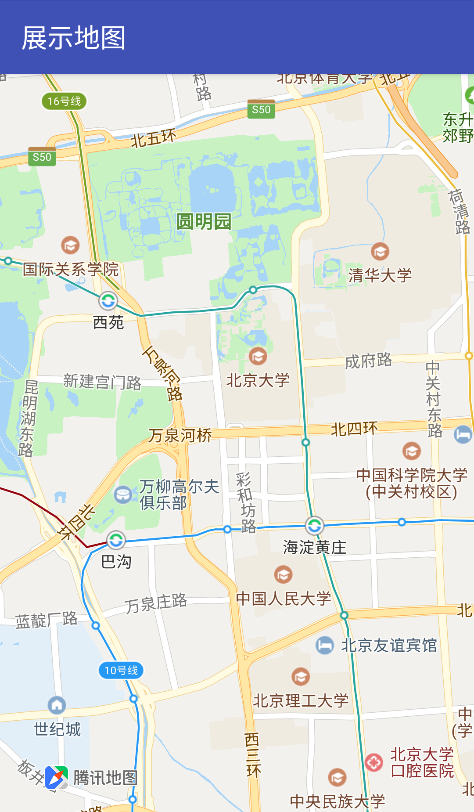

# 地图商标

### 简介

在您的应用中使用我们的地图 SDK 时，按照[腾讯地图开放API服务协议](https://lbs.qq.com/terms.html)我们要求始终保持我们的商标是可见的，不允许对腾讯地图的商标进行遮盖、修改等弱化地图品牌的行为。

### 调整位置

在各种各样的 APP 的设计中，我们的商标可能会被开发者的上层控件遮挡，所以我们提供了商标调整位置的功能帮助用户满足[腾讯地图开放API服务协议](https://lbs.qq.com/terms.html)提出的要求。地图控件相关的控制在 `UiSettings` 类中提供，用户可以通过 `TencentMap.getUiSettings()` 获取这个类的实例。我们推荐使用下面两个接口设置地图商标的位置：

1. setLogoPosition(int logoAnchor) 

   `logoAnchor` 设置地图商标位置
   - TencentMapOptions.LOGO_POSITION_BOTTOM_CENTER 底边中心
   - TencentMapOptions.LOGO_POSITION_BOTTOM_LEFT 左下角
   - TencentMapOptions.LOGO_POSITION_BOTTOM_RIGHT 右下角
   - TencentMapOptions.LOGO_POSITION_TOP_CENTER 顶部中心
   - TencentMapOptions.LOGO_POSITION_TOP_LEFT 左上角
   - TencentMapOptions.LOGO_POSITION_TOP_RIGHT 右上角

2. setLogoPosition(int logoAnchor, int[] marginParams)

   这个接口中 `logoAnchor` 只支持将地图商标放到 MapView 的四个角落，但提供了设置商标与 MapView 边缘的间距的能力，比上一个接口功能更强大。

   `logoAnchor` 设置地图商标位置
   - TencentMapOptions.LOGO_POSITION_BOTTOM_LEFT 左下角
   - TencentMapOptions.LOGO_POSITION_BOTTOM_RIGHT 右下角
   - TencentMapOptions.LOGO_POSITION_TOP_LEFT 左上角
   - TencentMapOptions.LOGO_POSITION_TOP_RIGHT 右上角

   `marginParams` 是一个长度为 2 的数组，表示商标与 MapView 边缘的间距
    - 若 `logoAnchor` 为 LOGO_POSITION_BOTTOM_LEFT, 则 Logo 的 bottomMargin 为 marginParams[0], leftMargin 为 marginParams[1]
    - 若 `logoAnchor` 为 LOGO_POSITION_BOTTOM_RIGHT, 则 Logo 的 bottomMargin 为 marginParams[0], rightMargin 为 marginParams[1]
    - 若 `logoAnchor` 为 LOGO_POSITION_TOP_RIGHT, 则 Logo 的 topMargin 为 marginParams[0], rightMargin 为 marginParams[1]
    - 若 `logoAnchor` 为 LOGO_POSITION_TOP_LEFT，则 Logo 的 topMargin 为 marginParams[0], leftMargin 为 marginParams[1]

### 使用示例

```java
tencentMap.getUiSettings().setLogoPosition(
        //logo 放到左下角
        TencentMapOptions.LOGO_POSITION_BOTTOM_LEFT,
        //logo 距离 mapView 底边 50 像素，左边 100 像素
        new int[]{50, 100});
```

默认在右下角的商标就被调整到了左下角，且指定了距离 MapView 边缘的像素值：
